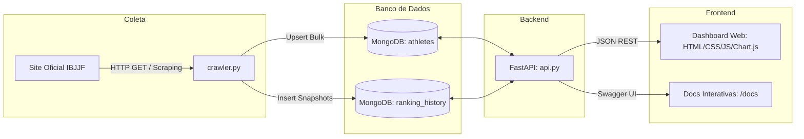

# 🥋 IBJJF Ranking — Web Scraping, API & Dashboard

Pipeline completo para extração, armazenamento, disponibilização via API REST e visualização analítica dos dados oficiais de atletas do ranking da **IBJJF (International Brazilian Jiu-Jitsu Federation)**.

---

## 📌 Sumário

- [Visão Geral](#-visão-geral)
- [Arquitetura da Solução](#-arquitetura-da-solução)
- [Tecnologias Utilizadas](#-tecnologias-utilizadas)
- [Estrutura do Projeto](#-estrutura-do-projeto)
- [Pré-requisitos](#-pré-requisitos)
- [Instalação e Configuração](#-instalação-e-configuração)
- [Como Executar](#-como-executar)
  - [1. Executar o Crawler](#1-executar-o-crawler)
  - [2. Iniciar a API FastAPI](#2-iniciar-a-api-fastapi)
  - [3. Abrir o Dashboard](#3-abrir-o-dashboard)
- [Documentação da API](#-documentação-da-api)
  - [Endpoints Principais](#endpoints-principais)
  - [Parâmetros de Filtro e Busca](#parâmetros-de-filtro-e-busca)
- [Modelagem no MongoDB](#-modelagem-no-mongodb)
- [Funcionalidades do Dashboard](#-funcionalidades-do-dashboard)
- [Licença](#-licença)

---

## 📖 Visão Geral

O projeto automatiza o fluxo de inteligência de dados sobre os rankings de Jiu-Jitsu da IBJJF:

1. **Scraping Confiável:** Um crawler em Python com BeautifulSoup e Requests extrai informações de posições, atletas, fotos, pontuações e perfis diretamente das tabelas oficiais da IBJJF.
2. **Persistência Inteligente em MongoDB:**
   - Coleção `athletes`: Mantém o **estado atual** deduplicado via chave composta e operações de `upsert`.
   - Coleção `ranking_history`: Armazena **snapshots históricos** de cada coleta, viabilizando análises de evolução temporal de desempenho.
3. **API REST com FastAPI:** Endpoints de alta performance com validação automática via Pydantic, paginação, ordenação dinâmica, agregação com pipelines MongoDB e suporte a CORS.
4. **Dashboard Analítico:** Interface web moderna, responsiva e dinâmica construída em HTML5, CSS3, Vanilla JS e Chart.js para explorar métricas, distribuições e o histórico individual de cada atleta em modais interativos.

---

## 🏗️ Arquitetura da Solução



---

## 🛠️ Tecnologias Utilizadas

| Camada | Ferramenta / Biblioteca | Descrição |
| :--- | :--- | :--- |
| **Linguagem** | Python 3.10+ | Linguagem principal do scraper e backend |
| **Scraping** | `requests` & `beautifulsoup4` | Requisições HTTP e parsing do DOM HTML |
| **Banco de Dados** | MongoDB (Atlas ou Local) & `pymongo` | Armazenamento flexível NoSQL em formato de documentos |
| **Backend / API** | `fastapi` & `uvicorn` | Framework web assíncrono para construção de APIs REST |
| **Validação** | `pydantic` | Validação de tipos e documentação de schemas |
| **Variáveis de Ambiente** | `python-dotenv` | Gestão de segredos e configurações via `.env` |
| **Frontend** | HTML5, CSS3 e Vanilla JS | Dashboard leve, modular e sem dependências pesadas |
| **Visualização de Dados** | Chart.js 4.4 | Gráficos interativos (barras, histograma, linhas) |

---

## 📁 Estrutura do Projeto

```text
Web-Scrapping/
├── dashboard/                 # Frontend do Dashboard
│   ├── app.js                 # Lógica de consumo da API, filtros, gráficos e modal
│   ├── index.html             # Estrutura HTML semântica
│   └── style.css              # Estilos personalizados (Dark/Light Modern Theme)
├── .env.example               # Exemplo de configuração de variáveis de ambiente
├── .gitignore                 # Arquivos ignorados pelo controle de versão
├── api.py                     # API REST em FastAPI com endpoints de agregação e filtros
├── crawler.py                 # Script de Web Scraping do ranking da IBJJF
├── database.py                # Conexão centralizada com o MongoDB via PyMongo
├── readme.md                  # Documentação completa do projeto
└── requirements.txt           # Dependências Python do projeto
```

---

## 📦 Pré-requisitos

- **Python**: versão 3.10 ou superior instalada ([python.org](https://www.python.org/downloads/)).
- **MongoDB**: cluster no [MongoDB Atlas](https://www.mongodb.com/cloud/atlas) (gratuito) ou instância local do MongoDB Server.
- **Git**: para clonar o repositório.

---

## ⚙️ Instalação e Configuração

### 1. Clonar o repositório
```bash
git clone https://github.com/Ntslopes/Web-Scrapping.git
cd Web-Scrapping
```

### 2. Criar e ativar o ambiente virtual (Recomendado)

**No Windows (PowerShell):**
```powershell
python -m venv .venv
.\.venv\Scripts\Activate.ps1
```

**No Linux / macOS:**
```bash
python3 -m venv .venv
source .venv/bin/activate
```

### 3. Instalar as dependências
```bash
pip install -r requirements.txt
```

### 4. Configurar as variáveis de ambiente
Copie o arquivo `.env.example` para `.env`:

```bash
cp .env.example .env
```
*(No Windows PowerShell: `Copy-Item .env.example .env`)*

Abra o arquivo `.env` e configure a sua string de conexão com o MongoDB:

```env
MONGODB_URI=mongodb+srv://<usuario>:<senha>@<cluster>.mongodb.net/?retryWrites=true&w=majority
```

---

## 🚀 Como Executar

O fluxo de execução consiste em 3 etapas simples:

### 1. Executar o Crawler
Para fazer a raspagem de dados das páginas do ranking e salvar no MongoDB:

```bash
python crawler.py
```

O script irá:
- Conectar ao MongoDB e criar os índices necessários (`unique` para evitar duplicatas).
- Paginar os rankings da IBJJF conforme configurado em `MAX_PAGES`.
- Realizar o parse dos atletas (nome, pontuação, ranking, foto, perfil e categorias).
- Atualizar a coleção `athletes` e registrar uma foto temporal em `ranking_history`.

> 💡 **Dica:** É possível rodar o script periodicamente (via Cron, Task Scheduler ou GitHub Actions) para acumular dados históricos de evolução de pontuação dos atletas.

---

### 2. Iniciar a API FastAPI
Inicie o servidor de desenvolvimento com recarregamento automático:

```bash
uvicorn api:app --reload
```

A API estará disponível em:
- **API Base:** [http://127.0.0.1:8000](http://127.0.0.1:8000)
- **Documentação Interativa Swagger UI:** [http://127.0.0.1:8000/docs](http://127.0.0.1:8000/docs)
- **Documentação Alternativa ReDoc:** [http://127.0.0.1:8000/redoc](http://127.0.0.1:8000/redoc)

---

### 3. Abrir o Dashboard

Com a API rodando na porta `8000`, sirva os arquivos da pasta `dashboard/`:

**Opção A — Servidor HTTP do Python (Recomendada):**
```bash
python -m http.server 3000 --directory dashboard
```
Acesse em seu navegador: [http://localhost:3000](http://localhost:3000).

**Opção B — Extensão Live Server:**
Abra a pasta no VS Code e clique com o botão direito em `dashboard/index.html` > **Open with Live Server**.

**Opção C — Diretamente pelo navegador:**
Abra o arquivo `dashboard/index.html` com dois cliques no navegador.

---

## 🔌 Documentação da API

### Endpoints Principais

| Método | Endpoint | Descrição |
| :--- | :--- | :--- |
| `GET` | `/` | Informações de status da API e links úteis |
| `GET` | `/health` | Diagnóstico de conexão com o banco de dados MongoDB |
| `GET` | `/athletes` | Lista paginada de atletas com busca, filtros e ordenação |
| `GET` | `/athletes/{id}` | Retorna detalhes completos de um atleta específico |
| `GET` | `/athletes/{id}/history`| Histórico de pontuação e posição do atleta ao longo das coletas |
| `GET` | `/filters` | Valores distintos disponíveis para preenchimento de filtros |
| `GET` | `/stats` | Estatísticas gerais agregadas (médias, min, max, líder, total de coletas) |
| `GET` | `/dashboard` | Payload consolidado para indicadores e gráficos do dashboard |

### Parâmetros de Filtro e Busca

O endpoint `/athletes` aceita os seguintes parâmetros de query string:

| Parâmetro | Tipo | Descrição | Exemplo |
| :--- | :--- | :--- | :--- |
| `search` | `string` | Busca case-insensitive no nome do atleta | `?search=buchecha` |
| `gender` | `string` | Filtro por gênero (`male`, `female`) | `?gender=male` |
| `belt` | `string` | Filtro por faixa (`black`, `brown`, etc.) | `?belt=black` |
| `age_category` | `string` | Categoria de idade (`adult`, `master`, etc.) | `?age_category=adult` |
| `ranking_type` | `string` | Tipo de ranking (`ranking-geral-gi`, etc.) | `?ranking_type=ranking-geral-gi` |
| `min_points` | `float` | Pontuação mínima | `?min_points=1000` |
| `max_points` | `float` | Pontuação máxima | `?max_points=5000` |
| `min_rank` | `int` | Posição mínima (ex.: top 10 = `min_rank=1&max_rank=10`) | `?min_rank=1` |
| `max_rank` | `int` | Posição máxima | `?max_rank=10` |
| `sort_by` | `string` | Campo para ordenação (`rank`, `points`, `name`, `last_collected_at`) | `?sort_by=points` |
| `order` | `string` | Direção da ordenação (`asc` ou `desc`) | `?order=desc` |
| `page` | `int` | Número da página (padrão: 1) | `?page=2` |
| `page_size` | `int` | Quantidade de itens por página (máx: 100, padrão: 20) | `?page_size=20` |

---

## 🗄️ Modelagem no MongoDB

O banco utiliza o banco de dados `ibjjfDB` com duas coleções:

### 1. Coleção `athletes`
Armazena a visão atual consolidada de cada atleta.
- **Índice Único Composto:**
  `[("name", 1), ("ranking_type", 1), ("age_category", 1), ("gender", 1), ("belt", 1)]`
- **Operação no Crawler:** `UpdateOne` com `$set` e `$setOnInsert` via `upsert=True`.

```json
{
  "_id": "67a3f890b0213f5d81b491a1",
  "name": "Erich Munis",
  "photo": "https://ibjjf.com/...",
  "points": 1845.0,
  "rank": 1,
  "profile_url": "https://ibjjf.com/athletes/...",
  "ranking_type": "ranking-geral-gi",
  "age_category": "adult",
  "gender": "male",
  "belt": "black",
  "source": {
    "site": "ibjjf.com",
    "url": "https://ibjjf.com/2026-athletes-ranking",
    "page": 1
  },
  "first_collected_at": "2026-10-06T18:00:00.000Z",
  "last_collected_at": "2026-10-06T18:00:00.000Z"
}
```

### 2. Coleção `ranking_history`
Armazena uma trilha histórica de cada coleta realizada, garantindo rastreabilidade temporal.
- **Índice:** `[("collected_at", -1), ("name", 1)]`

---

## 📊 Funcionalidades do Dashboard

- **Indicadores Rápidos (KPI Cards):** Total de Atletas, Pontuação Média, Pontuação Máxima, Líder do Ranking e Contagem de Coletas realizadas.
- **Top 10 Atletas (Bar Chart):** Gráfico horizontal/vertical comparando a pontuação dos melhores atletas filtrados.
- **Distribuição de Pontuação (Histograma):** Faixas de pontuação calculadas dinamicamente com o aggregation `$bucketAuto` do MongoDB.
- **Evolução Temporal (Line Chart):** Evolução da pontuação média e volume de atletas ao longo das diferentes execuções do crawler.
- **Tabela com Ordenação e Paginação:** Tabela interativa com ordenação nas colunas de Posição, Nome e Pontuação.
- **Modal de Detalhes do Atleta:** Clique em qualquer atleta na tabela para abrir um modal com foto, estatísticas detalhadas e gráfico da sua evolução de pontos individual.
- **Tratamento de Falhas e Estados de Loading:** Skeleton loading e banner de reconexão em caso de indisponibilidade da API.

---

## 📄 Licença

Este projeto foi desenvolvido para fins educacionais e de estudo sobre Web Scraping, APIs assíncronas e visualização de dados. Sinta-se livre para usar, estudar e contribuir.
