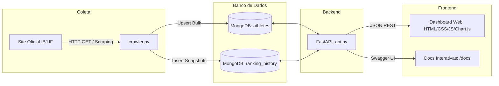
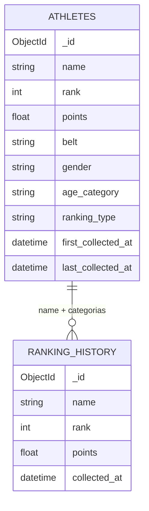

# 🥋 IBJJF Ranking — Web Scraping, API & Dashboard

Pipeline completo para extração, armazenamento, disponibilização via API REST e visualização analítica dos dados oficiais de atletas do ranking da **IBJJF (International Brazilian Jiu-Jitsu Federation)**.

---

## 📌 Sumário

- [Visão Geral](#-visão-geral)
- [Site Escolhido e Dados Coletados](#-site-escolhido-e-dados-coletados)
- [Arquitetura da Solução](#-arquitetura-da-solução)
- [Tecnologias Utilizadas](#-tecnologias-utilizadas)
- [Estrutura do Projeto](#-estrutura-do-projeto)
- [Pré-requisitos](#-pré-requisitos)
- [Instalação e Configuração](#-instalação-e-configuração)
- [Como Executar](#-como-executar)
- [Documentação da API](#-documentação-da-api)
- [Modelagem no MongoDB](#-modelagem-no-mongodb)
- [Funcionalidades do Dashboard](#-funcionalidades-do-dashboard)
- [Licença](#-licença)

---

## 📖 Visão Geral

O projeto automatiza o fluxo de inteligência de dados sobre os rankings de Jiu-Jitsu da IBJJF:

1. **Scraping Confiável:** Um crawler em Python com BeautifulSoup e Requests extrai informações de posições, atletas, fotos, pontuações e perfis diretamente das tabelas oficiais da IBJJF.
2. **Persistência Inteligente em MongoDB:**
   - Coleção `athletes`: mantém o **estado atual** deduplicado via chave composta e operações de `upsert`.
   - Coleção `ranking_history`: armazena **snapshots históricos** de cada coleta, viabilizando análises de evolução temporal de desempenho.
3. **API REST com FastAPI:** Endpoints com validação automática via Pydantic, paginação, ordenação dinâmica, agregação com pipelines MongoDB e suporte a CORS.
4. **Dashboard Analítico:** Interface web responsiva construída em HTML5, CSS3, Vanilla JS e Chart.js para explorar métricas, distribuições e o histórico individual de cada atleta em modais interativos.

---

## 🌐 Site Escolhido e Dados Coletados

### O site

| Item | Detalhe |
| :--- | :--- |
| **Site** | [IBJJF — International Brazilian Jiu-Jitsu Federation](https://ibjjf.com) |
| **Página coletada** | Ranking oficial de atletas: `https://ibjjf.com/2026-athletes-ranking` |
| **Natureza dos dados** | Dados públicos, exibidos em tabelas HTML paginadas |
| **Por que foi escolhido** | A IBJJF é a principal federação de Jiu-Jitsu do mundo. O ranking é estruturado, atualizado com frequência e permite análises de evolução ao longo do tempo (pontuação, posição, categorias). |

### Dimensões do ranking

O ranking é segmentado por combinações dos seguintes atributos, e o crawler percorre cada combinação configurada:

| Dimensão | Exemplos de valores |
| :--- | :--- |
| `ranking_type` | `ranking-geral-gi`, etc. |
| `gender` | `male`, `female` |
| `belt` | `black`, `brown`, etc. |
| `age_category` | `adult`, `master`, etc. |

### Dados coletados por atleta

| Campo | Tipo | Descrição | Origem |
| :--- | :--- | :--- | :--- |
| `name` | string | Nome do atleta | Tabela do ranking |
| `rank` | int | Posição no ranking da categoria | Tabela do ranking |
| `points` | float | Pontuação acumulada | Tabela do ranking |
| `photo` | string (URL) | Foto do atleta | Tabela do ranking |
| `profile_url` | string (URL) | Link para o perfil do atleta | Tabela do ranking |
| `ranking_type` | string | Tipo de ranking | Parâmetro da coleta |
| `age_category` | string | Categoria de idade | Parâmetro da coleta |
| `gender` | string | Gênero | Parâmetro da coleta |
| `belt` | string | Faixa | Parâmetro da coleta |
| `source` | objeto | Site, URL e página de origem (rastreabilidade) | Gerado pelo crawler |
| `first_collected_at` / `last_collected_at` | datetime (UTC) | Primeira e última coleta do atleta | Gerado pelo crawler |

### Boas práticas na coleta

- Os dados coletados são **públicos** e usados apenas para fins educacionais.
- O crawler limita o número de páginas por execução (`MAX_PAGES`) para não sobrecarregar o servidor.
- Recomenda-se respeitar o `robots.txt` e os termos de uso do site e manter intervalos razoáveis entre execuções.

---

## 🏗️ Arquitetura da Solução



---

## 🛠️ Tecnologias Utilizadas

| Camada | Ferramenta / Biblioteca | Descrição |
| :--- | :--- | :--- |
| **Linguagem** | Python 3.10+ | Linguagem principal do scraper e backend |
| **Scraping** | `requests` & `beautifulsoup4` | Requisições HTTP e parsing do DOM HTML |
| **Banco de Dados** | MongoDB (Atlas ou Local) & `pymongo` | Armazenamento NoSQL em documentos |
| **Backend / API** | `fastapi` & `uvicorn` | Framework web assíncrono para APIs REST |
| **Validação** | `pydantic` | Validação de tipos e documentação de schemas |
| **Variáveis de Ambiente** | `python-dotenv` | Gestão de segredos e configurações via `.env` |
| **Frontend** | HTML5, CSS3 e Vanilla JS | Dashboard leve, modular e sem dependências pesadas |
| **Visualização de Dados** | Chart.js 4.4 | Gráficos interativos (barras, histograma, linhas) |

---

## 📁 Estrutura do Projeto

```text
Web-Scrapping/
├── dashboard/                 # Frontend do Dashboard
│   ├── app.js                 # Consumo da API, filtros, gráficos e modal
│   ├── index.html             # Estrutura HTML semântica
│   └── style.css              # Estilos personalizados
├── .env.example               # Exemplo de variáveis de ambiente
├── .gitignore                 # Arquivos ignorados pelo Git
├── api.py                     # API REST em FastAPI
├── crawler.py                 # Script de Web Scraping do ranking da IBJJF
├── database.py                # Conexão centralizada com o MongoDB (PyMongo)
├── readme.md                  # Documentação do projeto
└── requirements.txt           # Dependências Python
```

---

## 📦 Pré-requisitos

- **Python** 3.10 ou superior ([python.org](https://www.python.org/downloads/)).
- **MongoDB**: cluster no [MongoDB Atlas](https://www.mongodb.com/cloud/atlas) (gratuito) ou instância local do MongoDB Server.
- **Git**: para clonar o repositório.

---

## ⚙️ Instalação e Configuração

### 1. Clonar o repositório
```bash
git clone https://github.com/Ntslopes/Web-Scrapping.git
cd Web-Scrapping
```

### 2. Criar e ativar o ambiente virtual (recomendado)

**Windows (PowerShell):**
```powershell
python -m venv .venv
.\.venv\Scripts\Activate.ps1
```

**Linux / macOS:**
```bash
python3 -m venv .venv
source .venv/bin/activate
```

### 3. Instalar as dependências
```bash
pip install -r requirements.txt
```

### 4. Configurar as variáveis de ambiente
```bash
cp .env.example .env
```
*(No Windows PowerShell: `Copy-Item .env.example .env`)*

Edite o `.env` com a sua string de conexão:

```env
MONGODB_URI=mongodb+srv://<usuario>:<senha>@<cluster>.mongodb.net/?retryWrites=true&w=majority
```

> Para MongoDB local, use `MONGODB_URI=mongodb://localhost:27017`.
> No Atlas, lembre-se de liberar o seu IP em **Network Access**.

### 5. (Opcional) Ajustar a quantidade de páginas coletadas
O número de páginas por execução é controlado pela constante `MAX_PAGES` no topo do `crawler.py`. Use valores baixos para testes.

---

## 🚀 Como Executar

O fluxo tem 3 etapas, executadas nesta ordem:

### 1. Executar o Crawler
```bash
python crawler.py
```

O script irá:
- Conectar ao MongoDB e criar os índices necessários (`unique` para evitar duplicatas).
- Paginar os rankings da IBJJF conforme `MAX_PAGES`.
- Extrair os atletas (nome, pontuação, ranking, foto, perfil e categorias).
- Atualizar a coleção `athletes` e registrar um snapshot em `ranking_history`.

> 💡 É possível rodar o script periodicamente (Cron, Task Scheduler ou GitHub Actions) para acumular histórico de evolução.

### 2. Iniciar a API FastAPI
```bash
uvicorn api:app --reload
```

- **API Base:** <http://127.0.0.1:8000>
- **Swagger UI:** <http://127.0.0.1:8000/docs>
- **ReDoc:** <http://127.0.0.1:8000/redoc>

**Verificação rápida:** acesse <http://127.0.0.1:8000/health>. A resposta deve indicar conexão ativa com o MongoDB.

### 3. Abrir o Dashboard
Com a API rodando na porta `8000`, sirva a pasta `dashboard/`:

**Opção A — Servidor HTTP do Python (recomendada):**
```bash
python -m http.server 3000 --directory dashboard
```
Acesse <http://localhost:3000>.

**Opção B — Live Server (VS Code):** clique com o botão direito em `dashboard/index.html` > **Open with Live Server**.

**Opção C — Direto no navegador:** abra `dashboard/index.html` com dois cliques.

---

## 🔌 Documentação da API

A documentação interativa completa (com schemas e botão "Try it out") fica em `/docs`. Abaixo, o resumo de cada endpoint.

### Endpoints

| Método | Endpoint | Descrição | Respostas |
| :--- | :--- | :--- | :--- |
| `GET` | `/` | Status da API e links úteis | `200` |
| `GET` | `/health` | Diagnóstico da conexão com o MongoDB | `200` |
| `GET` | `/athletes` | Lista paginada com busca, filtros e ordenação | `200`, `422` |
| `GET` | `/athletes/{id}` | Detalhes de um atleta (`id` = `_id` do MongoDB) | `200`, `404`, `422` |
| `GET` | `/athletes/{id}/history` | Histórico de pontuação e posição do atleta | `200`, `404` |
| `GET` | `/filters` | Valores distintos para preencher filtros | `200` |
| `GET` | `/stats` | Estatísticas agregadas (média, mín., máx., líder, total de coletas) | `200` |
| `GET` | `/dashboard` | Payload consolidado para indicadores e gráficos | `200` |

### Parâmetros do endpoint `/athletes`

| Parâmetro | Tipo | Descrição | Exemplo |
| :--- | :--- | :--- | :--- |
| `search` | `string` | Busca case-insensitive no nome | `?search=buchecha` |
| `gender` | `string` | Gênero (`male`, `female`) | `?gender=male` |
| `belt` | `string` | Faixa (`black`, `brown`, etc.) | `?belt=black` |
| `age_category` | `string` | Categoria de idade (`adult`, `master`, etc.) | `?age_category=adult` |
| `ranking_type` | `string` | Tipo de ranking | `?ranking_type=ranking-geral-gi` |
| `min_points` | `float` | Pontuação mínima | `?min_points=1000` |
| `max_points` | `float` | Pontuação máxima | `?max_points=5000` |
| `min_rank` | `int` | Posição mínima (top 10 = `min_rank=1&max_rank=10`) | `?min_rank=1` |
| `max_rank` | `int` | Posição máxima | `?max_rank=10` |
| `sort_by` | `string` | `rank`, `points`, `name`, `last_collected_at` | `?sort_by=points` |
| `order` | `string` | `asc` ou `desc` | `?order=desc` |
| `page` | `int` | Página (padrão: 1) | `?page=2` |
| `page_size` | `int` | Itens por página (máx. 100, padrão 20) | `?page_size=20` |

### Exemplos de uso

**Top 10 atletas masculinos faixa preta, por pontuação:**
```bash
curl "http://127.0.0.1:8000/athletes?gender=male&belt=black&sort_by=points&order=desc&page_size=10"
```

**Buscar por nome:**
```bash
curl "http://127.0.0.1:8000/athletes?search=erich"
```

**Detalhes e histórico de um atleta:**
```bash
curl "http://127.0.0.1:8000/athletes/67a3f890b0213f5d81b491a1"
curl "http://127.0.0.1:8000/athletes/67a3f890b0213f5d81b491a1/history"
```

**Estatísticas gerais:**
```bash
curl "http://127.0.0.1:8000/stats"
```

**Exemplo ilustrativo de resposta de `/athletes`** (confira o formato exato em `/docs`):
```json
{
  "page": 1,
  "page_size": 10,
  "total": 250,
  "items": [
    {
      "id": "67a3f890b0213f5d81b491a1",
      "name": "Erich Munis",
      "rank": 1,
      "points": 1845.0,
      "belt": "black",
      "gender": "male",
      "age_category": "adult",
      "ranking_type": "ranking-geral-gi"
    }
  ]
}
```

---

## 🗄️ Modelagem no MongoDB

- **Banco de dados:** `ibjjfDB`
- **Coleções:** `athletes` e `ranking_history`



### 1. Coleção `athletes` — estado atual
Guarda a visão atual consolidada de cada atleta (um documento por atleta em cada categoria).

- **Índice único composto:** `[("name", 1), ("ranking_type", 1), ("age_category", 1), ("gender", 1), ("belt", 1)]`
- **Operação no crawler:** `UpdateOne` com `$set` e `$setOnInsert` via `upsert=True` (`first_collected_at` só é gravado na criação).

| Campo | Tipo | Descrição |
| :--- | :--- | :--- |
| `_id` | ObjectId | Identificador gerado pelo MongoDB |
| `name` | string | Nome do atleta |
| `photo` | string | URL da foto |
| `points` | double | Pontuação atual |
| `rank` | int | Posição atual na categoria |
| `profile_url` | string | URL do perfil na IBJJF |
| `ranking_type` / `age_category` / `gender` / `belt` | string | Dimensões do ranking (compõem a chave única) |
| `source` | object | `site`, `url` e `page` de onde o dado foi extraído |
| `first_collected_at` | date | Primeira vez que o atleta foi coletado |
| `last_collected_at` | date | Última atualização |

```json
{
  "_id": "67a3f890b0213f5d81b491a1",
  "name": "Erich Munis",
  "photo": "https://ibjjf.com/...",
  "points": 1845.0,
  "rank": 1,
  "profile_url": "https://ibjjf.com/athletes/...",
  "ranking_type": "ranking-geral-gi",
  "age_category": "adult",
  "gender": "male",
  "belt": "black",
  "source": {
    "site": "ibjjf.com",
    "url": "https://ibjjf.com/2026-athletes-ranking",
    "page": 1
  },
  "first_collected_at": "2026-10-06T18:00:00.000Z",
  "last_collected_at": "2026-10-06T18:00:00.000Z"
}
```

### 2. Coleção `ranking_history` — snapshots
Guarda um registro por atleta a cada coleta, o que permite montar a evolução temporal.

- **Índice:** `[("collected_at", -1), ("name", 1)]`
- **Operação no crawler:** `insert_many` ao final de cada execução (nunca sobrescreve).

| Campo | Tipo | Descrição |
| :--- | :--- | :--- |
| `_id` | ObjectId | Identificador do snapshot |
| `name` | string | Nome do atleta |
| `rank` / `points` | int / double | Posição e pontuação no momento da coleta |
| `ranking_type` / `age_category` / `gender` / `belt` | string | Categoria do snapshot |
| `collected_at` | date | Momento da coleta |

```json
{
  "_id": "67a3f8a2b0213f5d81b49200",
  "name": "Erich Munis",
  "rank": 1,
  "points": 1845.0,
  "ranking_type": "ranking-geral-gi",
  "age_category": "adult",
  "gender": "male",
  "belt": "black",
  "collected_at": "2026-10-06T18:00:00.000Z"
}
```

---

## 📊 Funcionalidades do Dashboard

- **KPI Cards:** Total de Atletas, Pontuação Média, Pontuação Máxima, Líder do Ranking e Contagem de Coletas.
- **Top 10 Atletas (Bar Chart):** compara a pontuação dos melhores atletas filtrados.
- **Distribuição de Pontuação (Histograma):** faixas calculadas dinamicamente com `$bucketAuto` do MongoDB.
- **Evolução Temporal (Line Chart):** pontuação média e volume de atletas ao longo das execuções do crawler.
- **Tabela com Ordenação e Paginação:** ordenação por Posição, Nome e Pontuação.
- **Modal de Detalhes do Atleta:** foto, estatísticas e gráfico de evolução individual.
- **Tratamento de Falhas:** skeleton loading e banner de reconexão se a API estiver indisponível.

---

## 📄 Licença

Este projeto foi desenvolvido para fins educacionais e de estudo sobre Web Scraping, APIs assíncronas e visualização de dados. Sinta-se livre para usar, estudar e contribuir.
